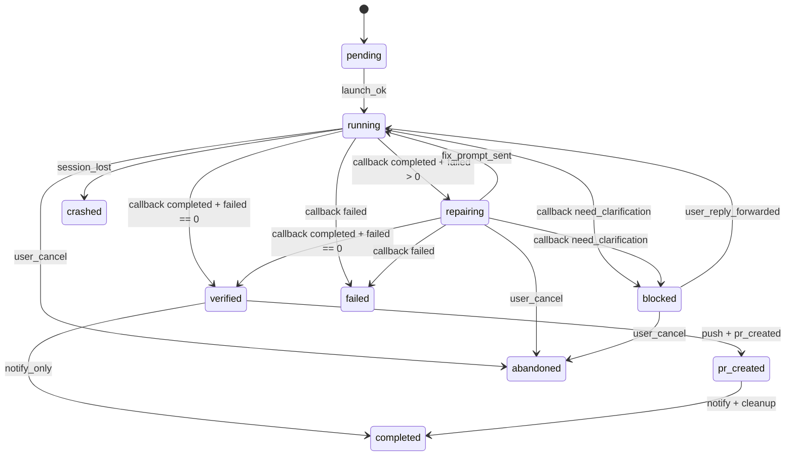

# Task Lifecycle

这个文件定义 `cli-coding-orchestrator` 的规范任务生命周期。

目标不是解释“为什么”，而是把关键状态和转移写成可检查、可实现、可迁移到 Lobster 的形式。

## State Diagram

## Canonical States

| State | Meaning | Entry Criteria | Exit Criteria |
|------|---------|----------------|---------------|
| `pending` | 环境已初始化，Agent 未启动 | `setup.sh` 成功 | `launch.sh` 成功 |
| `running` | Agent 正在执行当前回合 | session 存在，等待有效 callback | 收到合法 callback、session 丢失、用户取消 |
| `repairing` | callback 表明任务完成但测试仍失败 | `status=completed` 且 `test_results.failed > 0` | 修复指令已发回同一 session |
| `blocked` | Agent 要求用户澄清 | `status=need_clarification` | 用户回复已转发给 Agent |
| `verified` | callback 合法且独立验证通过 | `status=completed` 且独立测试通过 | 创建 PR 或直接通知完成 |
| `pr_created` | 分支已推送且 PR 已创建 | `git push` + `gh pr create` 成功 | 通知和清理完成 |
| `completed` | 任务成功闭环 | `verified` 后完成通知或 `pr_created` 后通知 | 终态 |
| `failed` | 任务失败且不可继续 | callback 明确失败，或 callback 契约违规超限 | 终态 |
| `crashed` | session 丢失或运行时崩溃 | backend 侧 session 消失 | 终态 |
| `abandoned` | 用户主动停止 | 用户取消并执行清理 | 终态 |

## Deterministic Transitions

| From | Event | To | Required Action |
|------|-------|----|-----------------|
| `draft` | task normalized | `pending` | 生成 `task_id` / branch / worktree，写入 memory |
| `pending` | launch success | `running` | 启动 Agent，callback 状态记为 `pending` |
| `running` | callback `completed` + `failed=0` | `verified` | 运行独立验证 |
| `running` | callback `completed` + `failed>0` | `repairing` | 向同一 session 发送修复指令 |
| `running` | callback `need_clarification` | `blocked` | 把 summary 转给用户 |
| `running` | callback `failed` | `failed` | 保存 callback，更新失败原因 |
| `running` | callback missing / invalid | `running` | 请求补交 callback，继续监控 |
| `repairing` | fix prompt sent | `running` | 回到正常监控 |
| `blocked` | user reply forwarded | `running` | 将用户答复送回原 session |
| `verified` | `auto_pr=true` + approval satisfied | `pr_created` | push branch + create PR |
| `verified` | no PR path | `completed` | 通知用户，按策略清理 |
| `pr_created` | notify + cleanup | `completed` | 更新 memory，结束任务 |
| `running` / `repairing` | session lost | `crashed` | 标记崩溃，保留排障信息 |
| any non-terminal | user cancel | `abandoned` | 停止 session，按边界清理 |

## Invariants

- 不得把 ACPX `[done]` 当作成功，除非拿到合法 `callback-json`
- 不得把 `completed + failed>0` 当作成功
- 没有合法 callback 时，不得 push / create PR
- `MEMORY.md` 和 `.clawdbot/active-tasks.json` 的终态必须一致
- 一个任务只能有一个终态

## Callback Repair Policy

当 callback 缺失或非法：

1. 在原 session 请求补交 callback
2. 继续监控，不要把任务标记为 `completed`
3. 超过重试上限后，标记 `failed`

这条规则同样适用于 ACPX `[done]` 已到达但 callback 未找到的情况。
